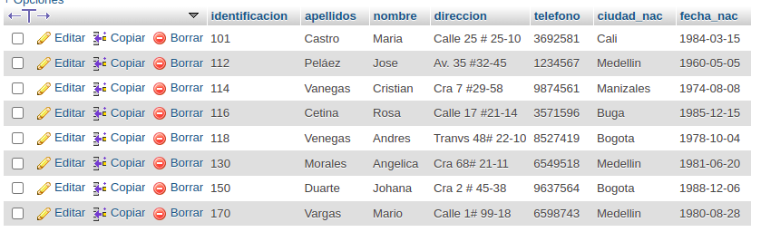
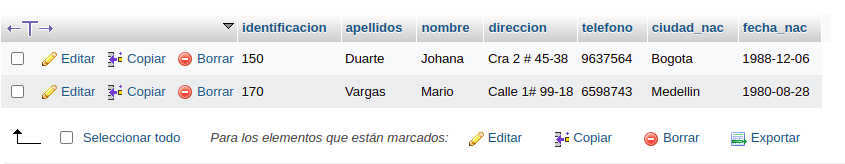
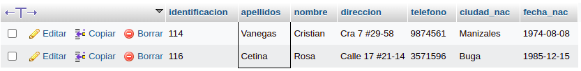
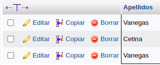

# consultas1

#  EJERCICIOS CONSULTAS SQL

## Tabla usuario

## COMANDO SELECT

1. Para visualisar toda la informacion que contiene la tabla `usuario` se puede incluir con la instruccion SELECT el caracter '*' o cada uno de los campos de la tabla
`select * from usuario` 

2. Visualizar solamente la identificacion del usuario.

`select identificacion from usuario`

3. Se desea obtener los registros cuya identificacion sean mayores o iguales a 150, se debe utilizar la clausula WHERE que especifica las condiciones que deben reunir los registros que se van a seleccionar.

`SELECT * FROM usuario WHERE Identificación >='150'`

4. Si desea obteer los registros cuyo sus apelidos sean Vanegas o Cetina, se ddebe utilizar el operador IN que especifica los registros que se quieren visualizar de una tabla

`SELECT apellidos FROM usuario WHERE apellidos IN ('Vanegas','Cetina')`

O se puede utilizar el operador OR.

`SELECT apellidos FROM usuario WHERE apellidos='Vanegas'OR apellidos='Cetina'`

5. Si se desea obtener los registros cuya identificacion sea menor de '110' y la ciudad sea 'Cali' se debe utilizar el operadodr AND

`SELECT * FROM usuario WHERE Identificaicon<'110' AND ciudad='Cali'`

6. Si se desea obtener los registros cuyos nombres  empiencen por la letra A , se debe utlizar el operador LIKE que utliza los patrones '%'(Todos) '_'(caracter).

`SELECT * FROM ususario WHERE nombre LIKE 'A%'`

7. Si desea obtener los registros de los nombres contengan la letra 'a'

`SELECT * FROM ususario WHERE nombre LIKE '%a%'`

8. Si se desea tener los registros donde la 4 letra del nombre sea una 'a' 

`SELECT * FROM ususario WHERE nombre LIKE '___a%`

9. Si se desea obtener los registros cuya identificacion este entre el intervalo 110 y 150, se debe utilizar la clausula BETWEN, que sirve para especificar un intervalo de valores 

`SELECT * FROM ususario WHERE identificacion BETWEEN '110' AND '150'`

## COMANDO DELET

10. Para eliminar solamente los registros cuya identificacion sea > de 130

`DELETE FROM usuario WHERE identificacion>'130'`

## COMANDO UPDATE 

11. Para actualizar la ciudad la ciudad de nacimiento de Cristian Vanegas, cuya identificacion es 114.

`UPDATE usario SET ciudad_nac = 'Manizales' WHERE Identificación='114'`

## INNER JOIN 

permite obtener datos o mas tablas. cuando se realiza la concatenacion de las tablas, no necesariamente se deben mostrar todos los datos de las tablas.